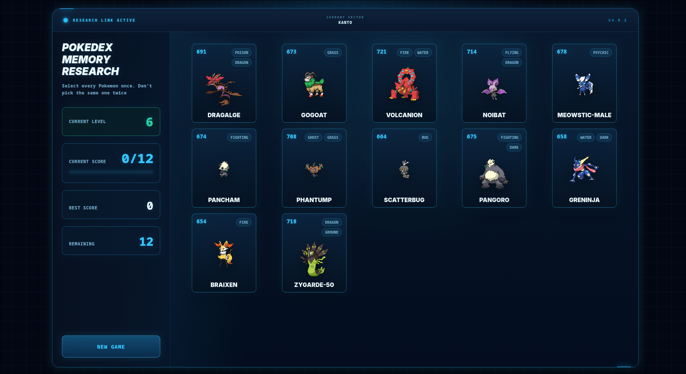
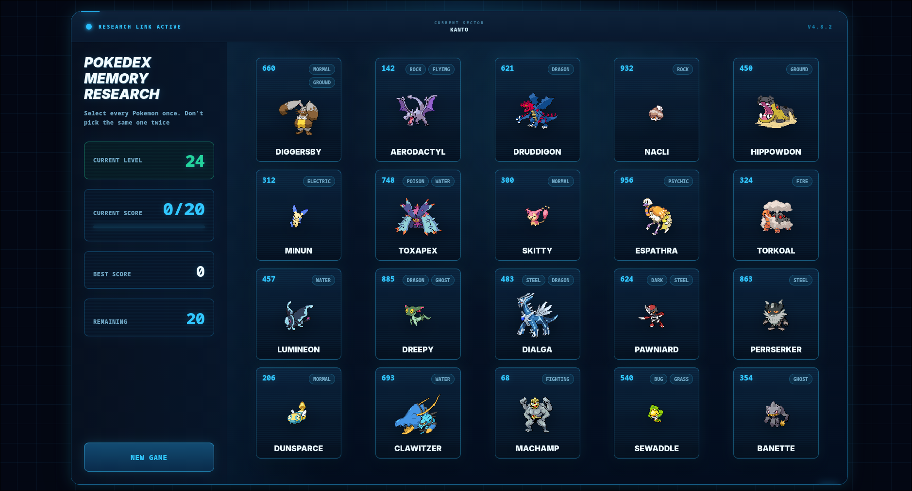
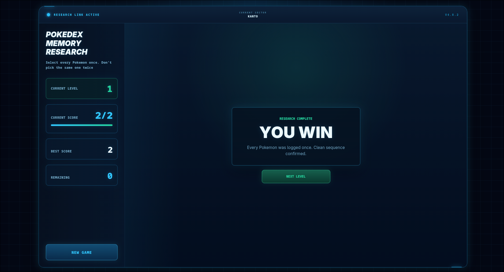
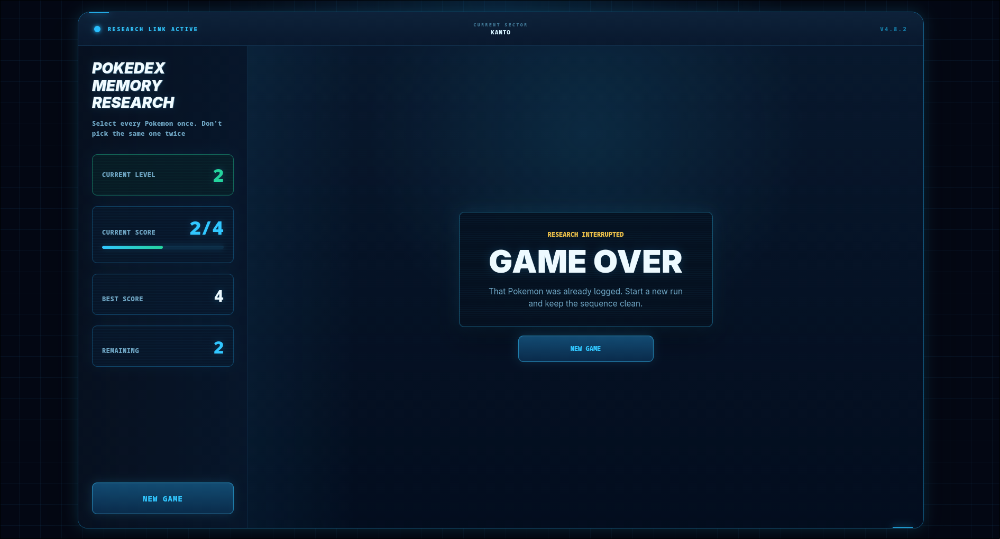

# Pokedex Memory Research

A Pokemon-themed memory card game built with React, TypeScript, and Vite. The goal is simple: select every Pokemon in the current level once without choosing the same card twice.

The app uses live Pokemon data from the PokeAPI and presents the game as a sci-fi Pokedex research interface with score tracking, level progression, win/loss states, and an endless-level card cap.

## Gameplay

- Click each Pokemon once to log it.
- Cards shuffle after every successful selection.
- Picking a Pokemon that was already logged ends the run.
- Completing a level unlocks the next level.
- A new game resets the run back to level 1.
- Levels continue beyond the generation list, while the board caps at 20 cards.

## Screenshots

### Level Progression





### Status Screens





## Features

- React + TypeScript frontend
- Vite development/build tooling
- PokeAPI-powered Pokemon card data
- Unique random cards per level
- Generation-based Pokemon ranges for levels 1-9
- Endless level progression after level 9
- 2 cards added per level until the board caps at 20 cards
- Cumulative best score across a run
- Per-level current score and remaining count
- Win, loss, loading, and error states
- Reload current level action for failed data loading
- Responsive board and analytics layout

## Tech Stack

- React 19
- TypeScript
- Vite
- ESLint
- PokeAPI

## Getting Started

Install dependencies from the frontend directory:

```bash
cd frontend
npm install
```

Start the development server:

```bash
npm run dev
```

Build for production:

```bash
npm run build
```

Run lint checks:

```bash
npm run lint
```

## Project Structure

```text
frontend/
  src/
    api/            PokeAPI loading and data mapping
    components/     Header, analytics, board, cards, status screens
    config/         Game status, level config, game logic helpers
    styles/         Component and layout styles
    types/          Game and Pokemon TypeScript types
docs/
  future-improvements.md
  *.png             App screenshots
```

## Notes

The game depends on network access to PokeAPI. If enough cards cannot be loaded for a level, the app enters an error state and exposes a reload-level action.

Potential future polish ideas are tracked in [docs/future-improvements.md](docs/future-improvements.md).
